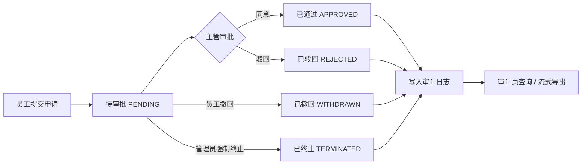
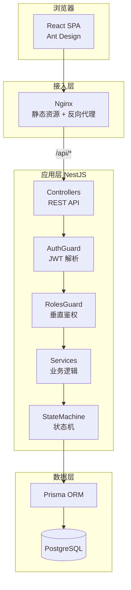
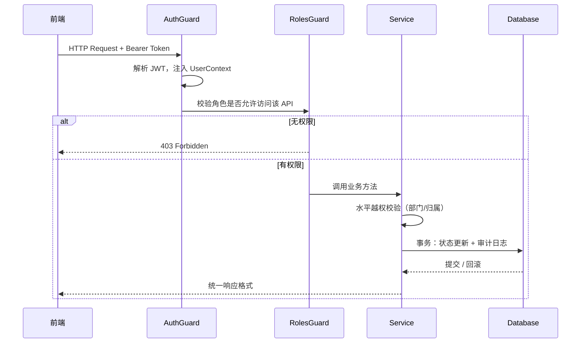
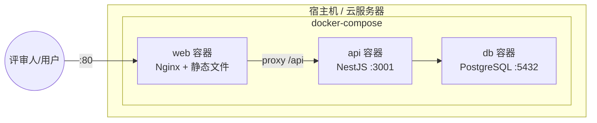
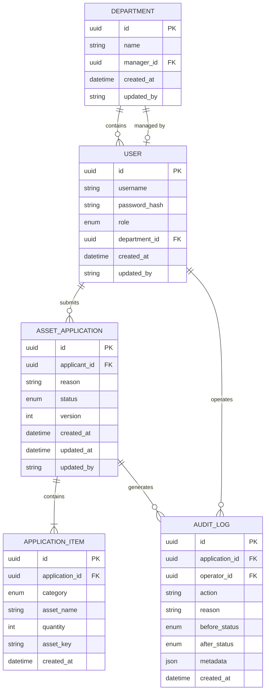
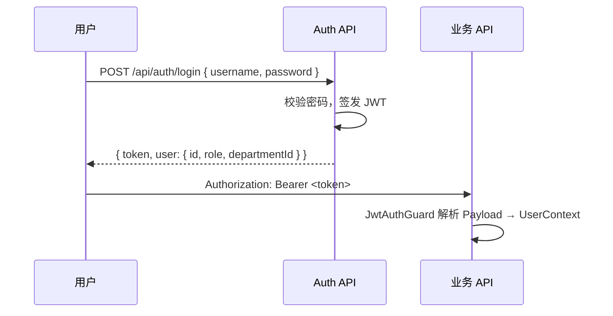
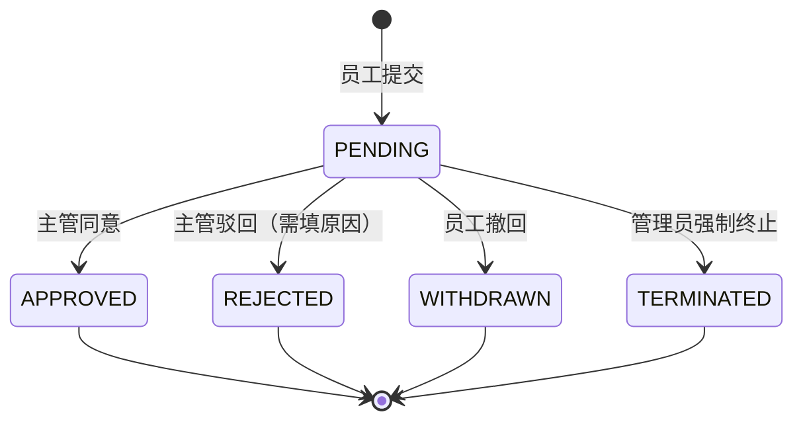
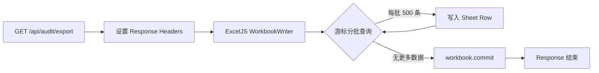

# 企业级资产流转与审批系统 — 技术架构方案

> **版本**：v1.0  
> **日期**：2026-07-03  
> **技术栈**：React + Ant Design + NestJS + Prisma + PostgreSQL + Docker Compose  
> **关联文档**：[全栈工程师认证题目及要求](../全栈工程师认证题目及要求.md)

---

## 目录

1. [方案概述](#1-方案概述)
2. [技术选型](#2-技术选型)
3. [系统架构](#3-系统架构)
4. [仓库与模块划分](#4-仓库与模块划分)
5. [领域模型与数据库设计](#5-领域模型与数据库设计)
6. [认证与权限设计](#6-认证与权限设计)
7. [审批状态机与事务设计](#7-审批状态机与事务设计)
8. [API 设计规范](#8-api-设计规范)
9. [前端架构设计](#9-前端架构设计)
10. [审计日志与数据脱敏](#10-审计日志与数据脱敏)
11. [海量数据流式导出](#11-海量数据流式导出)
12. [测试与质量保障](#12-测试与质量保障)
13. [部署与运维](#13-部署与运维)
14. [安全设计](#14-安全设计)
15. [评分点对齐清单](#15-评分点对齐清单)

---

## 1. 方案概述

### 1.1 建设目标

构建一套覆盖 **申请 → 审批 → 审计** 全链路的企业级资产流转系统，满足认证题目在动态表单、RBAC 权限、状态机事务、流式导出、自动化测试等方面的全部评分要求。

### 1.2 设计原则

| 原则 | 说明 |
|------|------|
| **安全在后端** | 权限校验、越权防御、状态流转均在 API 层强制执行，前端仅做体验层控制 |
| **单体优先** | 3 个核心页面、4 种角色，采用 Monorepo 单体应用，避免微服务过度设计 |
| **可评审** | 5 分钟内本地 Docker 一键启动，种子数据预置多角色账号与审计样本 |
| **可测试** | 核心链路、越权流、状态边界均有自动化接口测试 |
| **可演进** | 模块边界清晰，后续可平滑拆分服务或替换组件 |

### 1.3 核心业务能力



---

## 2. 技术选型

### 2.1 技术栈总览

| 层级 | 技术 | 版本建议 | 选型理由 |
|------|------|----------|----------|
| 前端框架 | React | 18.x | 生态成熟，组件化与动态表单方案丰富 |
| 前端语言 | TypeScript | 5.x | 类型安全，前后端共享类型 |
| 构建工具 | Vite | 5.x | 开发热更新快，生产构建轻量 |
| UI 组件库 | Ant Design | 5.x | `Form.List` 天然支持动态明细增删 |
| 路由 | React Router | 6.x | 声明式路由守卫，403 拦截 |
| 请求库 | Axios | 1.x | 拦截器统一处理 Token / 错误码 |
| 前端状态 | Zustand | 4.x | 轻量，管理用户会话与角色 |
| 表单校验 | Ant Design Form + Zod | — | 字段级红字提示 + 提交前整表校验 |
| 后端框架 | NestJS | 10.x | Guard / Interceptor / Pipe 与 RBAC 模型契合 |
| ORM | Prisma | 5.x | 类型安全、事务、`$transaction`、乐观锁友好 |
| 数据库 | PostgreSQL | 15.x | ACID 事务可靠，适合审批流与审计 |
| 认证 | JWT | — | 无状态，部署简单，角色写入 Payload |
| Excel 导出 | exceljs | 4.x | 原生 Stream Writer，支持大文件流式写出 |
| API 测试 | Jest + Supertest | — | 与 NestJS 原生集成 |
| 容器化 | Docker Compose | 2.x | 一键拉起 DB + API + Web |

### 2.2 不采用的方案及原因

| 方案 | 原因 |
|------|------|
| 微服务架构 | 业务规模小，增加部署与联调成本 |
| MongoDB | 审批流、事务、乐观锁更适合关系型数据库 |
| Next.js SSR | 无 SEO 需求，CSR + Vite 更简单 |
| 纯前端权限控制 | 不满足后端垂直/水平鉴权评分要求 |

---

## 3. 系统架构

### 3.1 逻辑架构



### 3.2 请求处理链路



### 3.3 部署架构（Docker Compose）



| 服务 | 端口 | 说明 |
|------|------|------|
| `web` | 80 | Nginx 托管前端构建产物，反向代理 `/api` |
| `api` | 3001（内部） | NestJS 应用 |
| `db` | 5432（内部） | PostgreSQL，数据持久化卷挂载 |

---

## 4. 仓库与模块划分

### 4.1 Monorepo 目录结构

```
asset-flow-sys/
├── apps/
│   ├── web/                        # 前端 React 应用
│   │   ├── src/
│   │   │   ├── api/                # Axios 封装 & API 调用
│   │   │   ├── components/         # 通用组件（AuthGuard、PermissionButton）
│   │   │   ├── hooks/              # useAuth、useDebounceCallback
│   │   │   ├── pages/
│   │   │   │   ├── Application/    # 资产申请页
│   │   │   │   ├── Approval/       # 审批工作台
│   │   │   │   ├── Audit/          # 审计日志页
│   │   │   │   ├── Login/          # 登录页（模拟多角色切换）
│   │   │   │   └── Forbidden/      # 403 页
│   │   │   ├── router/             # 路由配置与守卫
│   │   │   ├── stores/             # Zustand 状态
│   │   │   ├── utils/              # 脱敏、格式化工具
│   │   │   └── types/              # 前端类型定义
│   │   ├── index.html
│   │   ├── vite.config.ts
│   │   └── package.json
│   │
│   └── api/                        # 后端 NestJS 应用
│       ├── src/
│       │   ├── common/             # 全局过滤器、拦截器、装饰器
│       │   │   ├── authorization/  # 主管管辖范围校验（manager-scope）
│       │   │   ├── guards/         # JwtAuthGuard、RolesGuard
│       │   │   ├── decorators/     # @Roles()、@CurrentUser()
│       │   │   ├── filters/        # 统一异常过滤器
│       │   │   └── interceptors/   # 响应包装拦截器
│       │   ├── modules/
│       │   │   ├── auth/           # 登录、JWT 签发
│       │   │   ├── users/          # 用户查询
│       │   │   ├── applications/   # 申请单 CRUD、提交、撤回
│       │   │   ├── approvals/      # 审批、驳回、强制终止
│       │   │   ├── audit/          # 审计日志查询、流式导出
│       │   │   └── prisma/         # PrismaService 全局模块
│       │   ├── app.module.ts
│       │   └── main.ts
│       ├── prisma/
│       │   ├── schema.prisma       # 数据模型
│       │   └── seed.ts             # 种子数据（用户、部门、5万条审计）
│       ├── test/                   # Jest + Supertest 集成测试
│       └── package.json
│
├── packages/
│   └── shared/                     # 前后端共享类型与常量（可选）
│       ├── src/
│       │   ├── enums.ts            # Role、ApplicationStatus、AssetCategory
│       │   └── types.ts
│       └── package.json
│
├── docker/
│   ├── api.Dockerfile
│   ├── web.Dockerfile
│   └── nginx.conf
├── docker-compose.yml
├── docker-compose.dev.yml          # 开发环境（仅 DB，本地跑前后端）
├── docs/
│   └── architecture.md             # 本文档
├── scripts/
│   └── init.sh                     # 一键初始化脚本
├── README.md
├── PROMPT.md
└── package.json                    # 根 workspace 配置
```

### 4.2 后端模块职责

| 模块 | 职责 |
|------|------|
| `auth` | 登录签发 JWT；解析用户身份 |
| `users` | 查询当前用户信息、部门 |
| `applications` | 创建申请、动态明细、提交、撤回、我的申请列表 |
| `approvals` | 待审批列表、同意/驳回、管理员全量列表、强制终止 |
| `audit` | 多条件筛选审计日志、脱敏返回、流式 Excel 导出 |
| `common` | 全局 Guard、统一响应、异常处理 |

### 4.3 前端页面与路由

| 路由 | 页面 | 允许角色 |
|------|------|----------|
| `/login` | 登录 | 公开 |
| `/application` | 资产申请 | `EMPLOYEE` 及以上 |
| `/approval` | 审批工作台 | 全部角色（视图按角色切换） |
| `/audit` | 审计日志 | `ADMIN`、`AUDITOR` |
| `/403` | 无权限 | 公开 |

---

## 5. 领域模型与数据库设计

### 5.1 ER 关系



### 5.2 Prisma Schema 核心定义

```prisma
enum Role {
  EMPLOYEE
  MANAGER
  ADMIN
  AUDITOR
}

enum ApplicationStatus {
  PENDING
  APPROVED
  REJECTED
  WITHDRAWN
  TERMINATED
}

enum AssetCategory {
  FIXED_ASSET        // 固定资产
  ELECTRONIC_DEVICE  // 电子设备
  SOFTWARE_LICENSE   // 软件许可证
  SENSITIVE_DATA     // 敏感数据权限
}

model Department {
  id         String   @id @default(uuid())
  name       String
  managerId  String?  @map("manager_id")
  manager    User?    @relation("DepartmentManager", fields: [managerId], references: [id])
  users      User[]   @relation("DepartmentUsers")
  createdAt  DateTime @default(now()) @map("created_at")
  updatedBy  String?  @map("updated_by")

  @@map("departments")
}

model User {
  id            String   @id @default(uuid())
  username      String   @unique
  passwordHash  String   @map("password_hash")
  role          Role
  departmentId  String   @map("department_id")
  department    Department @relation("DepartmentUsers", fields: [departmentId], references: [id])
  managedDepts  Department[] @relation("DepartmentManager")
  applications  AssetApplication[]
  auditLogs     AuditLog[]
  createdAt     DateTime @default(now()) @map("created_at")
  updatedBy     String?  @map("updated_by")

  @@map("users")
}

model AssetApplication {
  id          String            @id @default(uuid())
  applicantId String            @map("applicant_id")
  applicant   User              @relation(fields: [applicantId], references: [id])
  reason      String            @db.VarChar(100)
  status      ApplicationStatus @default(PENDING)
  version     Int               @default(0)  // 乐观锁
  items       ApplicationItem[]
  auditLogs   AuditLog[]
  createdAt   DateTime          @default(now()) @map("created_at")
  updatedAt   DateTime          @updatedAt @map("updated_at")
  updatedBy   String?           @map("updated_by")

  @@index([applicantId, status])
  @@index([status, createdAt])
  @@map("asset_applications")
}

model ApplicationItem {
  id            String        @id @default(uuid())
  applicationId String        @map("application_id")
  application   AssetApplication @relation(fields: [applicationId], references: [id], onDelete: Cascade)
  category      AssetCategory
  assetName     String        @map("asset_name")
  quantity      Int
  assetKey      String?       @map("asset_key")  // 敏感字段，如 SECRET_KEY_2026_X
  createdAt     DateTime      @default(now()) @map("created_at")

  @@map("application_items")
}

model AuditLog {
  id            String             @id @default(uuid())
  applicationId String             @map("application_id")
  application   AssetApplication   @relation(fields: [applicationId], references: [id])
  operatorId    String             @map("operator_id")
  operator      User               @relation(fields: [operatorId], references: [id])
  action        String             // SUBMIT / APPROVE / REJECT / WITHDRAW / TERMINATE
  reason        String?
  beforeStatus  ApplicationStatus? @map("before_status")
  afterStatus   ApplicationStatus  @map("after_status")
  metadata      Json?
  createdAt     DateTime           @default(now()) @map("created_at")

  @@index([applicationId])
  @@index([operatorId])
  @@index([createdAt])
  @@index([afterStatus, createdAt])
  @@map("sys_audit_log")
}
```

### 5.3 索引策略

| 表 | 索引 | 用途 |
|----|------|------|
| `asset_applications` | `(applicant_id, status)` | 员工「我的申请」列表 |
| `asset_applications` | `(status, created_at)` | 主管「待我审批」、管理员全量列表 |
| `sys_audit_log` | `(created_at)` | 审计页时间区间查询 |
| `sys_audit_log` | `(after_status, created_at)` | 审计日志自身状态索引（业务筛选走申请单 `status`） |

### 5.4 种子数据规划

| 数据 | 数量 | 说明 |
|------|------|------|
| 部门 | 2+ | 研发部、市场部，各配 1 名主管 |
| 用户 | 6+ | 每角色至少 1 个账号，含跨部门主管用于越权测试 |
| 申请单 | 20+ | 覆盖各状态 |
| 审计日志 | 50,000+ | 用于流式导出压测与列表防抖体验 |

**预置测试账号示例**：

| 用户名 | 角色 | 部门 | 用途 |
|--------|------|------|------|
| `employee_a` | EMPLOYEE | 研发部 | 正常申请、撤回 |
| `manager_a` | MANAGER | 研发部 | 审批本部门 |
| `manager_b` | MANAGER | 市场部 | 越权测试（审批 A 部门单子应 403） |
| `admin` | ADMIN | — | 全量列表、强制终止 |
| `auditor` | AUDITOR | — | 审计页、导出 |

---

## 6. 认证与权限设计

### 6.1 认证方案

采用 **JWT Bearer Token** 无状态认证：



**JWT Payload 结构**：

```typescript
interface JwtPayload {
  sub: string;          // userId
  username: string;
  role: Role;
  departmentId: string;
}
```

### 6.2 RBAC 角色权限矩阵

| 能力 | EMPLOYEE | MANAGER | ADMIN | AUDITOR |
|------|:--------:|:-------:|:-----:|:-------:|
| 提交申请 | ✅ | ✅ | ✅ | ❌ |
| 查看自己的申请 | ✅ | ✅ | ✅ | ❌ |
| 撤回（PENDING） | ✅ | ❌ | ❌ | ❌ |
| 待我审批列表 | ❌ | ✅ | ❌ | ❌ |
| 同意 / 驳回 | ❌ | ✅¹ | ❌ | ❌ |
| 全量申请列表 | ❌ | ❌ | ✅ | ❌ |
| 强制终止 | ❌ | ❌ | ✅ | ❌ |
| 审计日志查询 | ❌ | ❌ | ✅ | ✅ |
| 导出 Excel | ❌ | ❌ | ✅ | ✅ |

> ¹ 主管仅可审批 **其管辖部门**（`departments.manager_id`）下属员工的单据

### 6.3 双层权限校验

#### 第一层：垂直鉴权（RolesGuard）

通过 `@Roles()` 装饰器声明 API 所需角色，Guard 在 Controller 入口拦截：

```typescript
@Roles(Role.MANAGER)
@Post(':id/approve')
approve(@Param('id') id: string, @CurrentUser() user: UserContext) {
  return this.approvalService.approve(id, user);
}
```

#### 第二层：水平鉴权（Service 层）

在业务 Service 内校验数据归属，防止改 ID 越权。主管权限通过 `departments.manager_id` 判定，而非主管自身的 `departmentId`：

```typescript
// apps/api/src/common/authorization/manager-scope.ts
export async function assertManagerOfDepartment(
  prisma: PrismaService,
  managerId: string,
  departmentId: string,
): Promise<void> {
  const department = await prisma.department.findUnique({
    where: { id: departmentId },
    select: { managerId: true },
  });
  if (!department || department.managerId !== managerId) {
    throw new ForbiddenException('无权审批其他部门的申请单');
  }
}

async approve(applicationId: string, operator: UserContext) {
  const app = await this.findWithApplicant(applicationId);

  if (operator.role === Role.MANAGER) {
    await assertManagerOfDepartment(this.prisma, operator.sub, app.applicant.departmentId);
  }

  return this.transition(app, operator, 'APPROVE');
}
```

待审批列表同样按 `manager_id` 过滤：`GET /api/approvals/pending` 仅返回 `applicant.departmentId IN (我管辖的部门)` 的 PENDING 单。

### 6.4 前端权限控制

| 层级 | 实现 | 评分要求 |
|------|------|----------|
| 路由级 | `<AuthGuard roles={[...]}>` 无权限跳转 `/403` | 手动改 URL 进 `/audit` 必须 403 |
| 按钮级 | 条件渲染 `{canApprove && <Button>}`，不渲染 DOM | 不能仅靠 CSS 隐藏 |
| 接口级 | 后端强制校验（前端权限可被绕过） | 不依赖前端 |

---

## 7. 审批状态机与事务设计

### 7.1 状态定义

| 状态 | 含义 | 终态 |
|------|------|:----:|
| `PENDING` | 待审批 | ❌ |
| `APPROVED` | 已通过 | ✅ |
| `REJECTED` | 已驳回 | ✅ |
| `WITHDRAWN` | 已撤回 | ✅ |
| `TERMINATED` | 已强制终止 | ✅ |

### 7.2 状态转换规则



**合法转换表**（代码内维护 Map，非法转换抛 `BadRequestException`）：

| 当前状态 | 操作 | 执行角色 | 目标状态 |
|----------|------|----------|----------|
| PENDING | SUBMIT | EMPLOYEE | PENDING |
| PENDING | APPROVE | MANAGER | APPROVED |
| PENDING | REJECT | MANAGER | REJECTED |
| PENDING | WITHDRAW | EMPLOYEE（本人） | WITHDRAWN |
| PENDING | TERMINATE | ADMIN | TERMINATED |

### 7.3 事务与乐观锁

每次状态变更在 **同一个 Prisma 事务** 中完成：

```typescript
async transition(app: AssetApplication, operator: UserContext, action: string, reason?: string) {
  return this.prisma.$transaction(async (tx) => {
    // 1. 乐观锁更新：version 不匹配则 affected count = 0
    const updated = await tx.assetApplication.updateMany({
      where: { id: app.id, version: app.version, status: app.status },
      data: {
        status: targetStatus,
        version: { increment: 1 },
        updatedBy: operator.username,
      },
    });

    if (updated.count === 0) {
      throw new ConflictException('单据状态已变更，请刷新后重试');
    }

    // 2. 同事务写入审计日志
    await tx.auditLog.create({
      data: {
        applicationId: app.id,
        operatorId: operator.sub,
        action,
        reason,
        beforeStatus: app.status,
        afterStatus: targetStatus,
      },
    });

    return { success: true };
  });
}
```

**并发场景**：两人同时审批同一单据，仅第一个 `updateMany` 成功；第二个因 `version` 或 `status` 不匹配返回友好错误，保证幂等。

---

## 8. API 设计规范

### 8.1 统一响应格式

```typescript
// 成功
{ "code": 0, "message": "success", "data": { ... } }

// 业务错误
{ "code": 40001, "message": "申请原因不能为空", "data": null }

// 权限错误
{ "code": 40300, "message": "无权审批其他部门的申请单", "data": null }
```

由全局 `ResponseInterceptor` 包装，`HttpExceptionFilter` 捕获异常并格式化。

### 8.2 核心 API 列表

#### 认证

| 方法 | 路径 | 角色 | 说明 |
|------|------|------|------|
| POST | `/api/auth/login` | 公开 | 登录，返回 JWT |
| GET | `/api/auth/me` | 已登录 | 当前用户信息 |

#### 申请单

| 方法 | 路径 | 角色 | 说明 |
|------|------|------|------|
| POST | `/api/applications` | EMPLOYEE+ | 创建并提交（status → PENDING） |
| POST | `/api/applications/:id/withdraw` | EMPLOYEE（本人） | 撤回 PENDING 单据 |
| GET | `/api/applications/mine` | EMPLOYEE+ | 我的申请列表（分页） |
| GET | `/api/applications/:id` | 相关角色 | 申请详情 |

#### 审批

| 方法 | 路径 | 角色 | 说明 |
|------|------|------|------|
| GET | `/api/approvals/pending` | MANAGER | 待我审批（本部门 PENDING） |
| POST | `/api/approvals/:id/approve` | MANAGER（本部门） | 同意 |
| POST | `/api/approvals/:id/reject` | MANAGER（本部门） | 驳回（body.reason 必填） |
| GET | `/api/approvals/all` | ADMIN | 全量申请列表 |
| POST | `/api/approvals/:id/terminate` | ADMIN | 强制终止 |

#### 审计

| 方法 | 路径 | 角色 | 说明 |
|------|------|------|------|
| GET | `/api/audit/logs` | ADMIN, AUDITOR | 多条件分页查询 |
| GET | `/api/audit/export` | ADMIN, AUDITOR | 流式 Excel 导出 |

### 8.3 审计查询参数

筛选条件均作用于 **关联申请单**（`asset_applications`），而非审计日志自身的后置状态或操作时间：

```
GET /api/audit/logs?applicantUsername=&applicantId=&category=&status=&startTime=&endTime=&page=1&pageSize=20
```

| 参数 | 类型 | 说明 |
|------|------|------|
| `applicantUsername` | string | 申请人用户名（模糊匹配，推荐；前端默认使用此参数） |
| `applicantId` | string | 申请人 UUID（精确匹配，兼容保留） |
| `category` | enum | 资产分类（申请单明细 `application_items.category`） |
| `status` | enum | **申请单**当前状态（`asset_applications.status`） |
| `startTime` | ISO8601 | **申请单**创建时间起（`asset_applications.created_at`） |
| `endTime` | ISO8601 | **申请单**创建时间止 |
| `page` | number | 页码 |
| `pageSize` | number | 每页条数 |

**响应字段补充**：每条审计记录返回 `applicationStatus`（申请单当前状态），便于列表展示与筛选语义对齐。

---

## 9. 前端架构设计

### 9.1 页面结构

#### 资产申请页 `/application`

```
ApplicationPage
├── ApplicationForm（主表：申请人、部门自动带出、申请原因）
└── AssetItemList（Form.List 动态明细）
    ├── 每行：资产分类 Select / 资产名称 Input / 数量 InputNumber
    ├── [➕ 添加资产明细] 按钮
    └── [提交] 按钮（全表单 validate → POST submit）
```

**校验规则**：

- 申请原因：必填，max 100 字
- 资产名称：必填
- 数量：必填，正整数，`min: 1`，`precision: 0`

#### 审批工作台 `/approval`

按角色渲染不同视图（同一页面组件，内部 `switch(role)`）：

| 角色 | 组件 | 功能 |
|------|------|------|
| EMPLOYEE | `MyApplicationsTable` | 列表 + 详情弹窗 + 撤回按钮（仅 PENDING） |
| MANAGER | `PendingApprovalsTable` | 列表 + 详情弹窗 + 同意/驳回（驳回 Modal 强制填原因） |
| ADMIN | `AllApplicationsTable` | 全量列表 + 强制终止 |

**防重复点击**：审批按钮 `loading={submitting}`，请求发出后立即 `setSubmitting(true)`。

#### 审计日志页 `/audit`

```
AuditPage
├── AuditFilterBar（申请人用户名、分类、单据状态、申请时间区间 — 300ms Debounce）
├── AuditLogTable（含 applicationStatus 列 + 脱敏 assetKey 列）
└── [导出 Excel] 按钮 → blob 流式下载（timeout 5 分钟，导出期间禁用筛选）
```

### 9.2 路由守卫实现

```tsx
function AuthGuard({ roles, children }: { roles?: Role[]; children: ReactNode }) {
  const { user, isAuthenticated } = useAuthStore();

  if (!isAuthenticated) return <Navigate to="/login" replace />;
  if (roles && !roles.includes(user.role)) return <Navigate to="/403" replace />;

  return <>{children}</>;
}
```

### 9.3 Axios 拦截器

```typescript
// 请求：自动附加 Authorization
axios.interceptors.request.use((config) => {
  const token = localStorage.getItem('token');
  if (token) config.headers.Authorization = `Bearer ${token}`;
  return config;
});

// 响应：401 跳登录，403 跳无权限页
axios.interceptors.response.use(
  (res) => res.data,
  (err) => {
    if (err.response?.status === 401) window.location.href = '/login';
    if (err.response?.status === 403) window.location.href = '/403';
    return Promise.reject(err);
  }
);
```

### 9.4 防抖搜索

```typescript
// apps/web/src/hooks/useDebounceCallback.ts
function useDebounceCallback<T extends (...args: never[]) => void>(callback: T, delay = 300): T {
  // 返回防抖后的 callback，用于 Audit 页 onValuesChange
}
```

---

## 10. 审计日志与数据脱敏

### 10.1 审计日志写入时机

| 操作 | action | 记录字段 |
|------|--------|----------|
| 提交申请 | `SUBMIT` | operator, before=null, after=PENDING |
| 同意 | `APPROVE` | operator, before=PENDING, after=APPROVED |
| 驳回 | `REJECT` | operator, reason, before=PENDING, after=REJECTED |
| 撤回 | `WITHDRAW` | operator, before=PENDING, after=WITHDRAWN |
| 强制终止 | `TERMINATE` | operator, before=PENDING, after=TERMINATED |

### 10.2 脱敏规则

**规则**：保留前缀与后缀，中间用 `****` 替代。

| 原始值 | 脱敏后 |
|--------|--------|
| `SECRET_KEY_2026_X` | `SEC-****-X` |
| `ASSET-2026-HARDWARE-001` | `ASS-****-001` |

**实现位置**：

```typescript
// packages/shared/src/mask.ts
export function maskAssetKey(key: string): string {
  if (!key || key.length < 5) return '****';
  const parts = key.split('_');
  if (parts.length >= 3) {
    return `${parts[0].slice(0, 3)}-****-${parts[parts.length - 1]}`;
  }
  return `${key.slice(0, 3)}-****-${key.slice(-1)}`;
}
```

- **后端**：列表/详情/导出 DTO 序列化时调用 `maskAssetKey()`
- **前端**：展示接口返回的已脱敏字段（脱敏逻辑以 `packages/shared` 为单一来源）

---

## 11. 海量数据流式导出

### 11.1 设计目标

- 支持 **≥ 50,000 条** 审计流水导出
- 导出期间后端 **内存平稳**，不发生 OOM
- 前端通过浏览器原生下载接收流式响应

### 11.2 实现方案



**关键代码思路**：

```typescript
@Get('export')
@Roles(Role.ADMIN, Role.AUDITOR)
async export(@Query() filters: AuditExportDto, @Res() res: Response) {
  res.setHeader('Content-Type', 'application/vnd.openxmlformats-officedocument.spreadsheetml.sheet');
  res.setHeader('Content-Disposition', 'attachment; filename=audit_logs.xlsx');

  const workbook = new ExcelJS.stream.xlsx.WorkbookWriter({ stream: res });
  const sheet = workbook.addWorksheet('审计日志');

  // 写表头
  sheet.addRow([
    '操作时间', '操作人', '动作', '驳回原因', '前置状态', '后置状态', '资产Key', '申请人', '单据状态',
  ]).commit();

  const BATCH_SIZE = 500;
  let cursor: string | undefined;

  while (true) {
    const batch = await this.prisma.auditLog.findMany({
      take: BATCH_SIZE,
      skip: cursor ? 1 : 0,
      cursor: cursor ? { id: cursor } : undefined,
      where: this.buildWhere(filters),
      orderBy: { id: 'asc' },
      include: { operator: true, application: { include: { applicant: true } } },
    });

    if (batch.length === 0) break;

    for (const log of batch) {
      sheet.addRow([
        log.createdAt.toISOString(),
        log.operator.username,
        log.action,
        log.reason ?? '',
        log.beforeStatus ?? '',
        log.afterStatus,
        maskAssetKey(log.metadata?.assetKey ?? ''),
        log.application.applicant.username,
        log.application.status,
      ]).commit();
    }

    cursor = batch[batch.length - 1].id;
    if (batch.length < BATCH_SIZE) break;
  }

  await workbook.commit();
}
```

### 11.3 禁止的做法

```typescript
// ❌ 一次性加载全部数据到内存
const allLogs = await prisma.auditLog.findMany({ where: filters }); // 5万条 OOM
const buffer = await workbook.xlsx.writeBuffer();
```

---

## 12. 测试与质量保障

### 12.1 测试分层

| 层级 | 工具 | 覆盖范围 |
|------|------|----------|
| API 集成测试 | Jest + Supertest | 核心链路、越权、状态边界 |
| 单元测试 | Jest | 状态机转换表、脱敏函数 |
| E2E（可选） | Playwright | 关键页面冒烟 |

### 12.2 必测用例清单

| # | 场景 | 操作 | 预期 |
|---|------|------|------|
| 1 | 正常审批流 | 员工提交 → 主管同意 | 201，`status=APPROVED`，audit_log 有 APPROVE 记录 |
| 2 | 垂直越权 | 员工调用 `POST /approvals/:id/approve` | **403** |
| 3 | 水平越权 | 主管 B 审批主管 A 管辖部门员工的单子 | **403** |
| 4 | 状态边界 | 对已 APPROVED 的单再次审批 | **409** 或 **400**，友好提示 |
| 5 | 驳回审计 | 主管驳回（带 reason） | audit_log 含 operator（含 username）、reason、before=PENDING、after=REJECTED |
| 6 | 脱敏校验 | 查询含 assetKey 的列表 | 返回中 assetKey 已脱敏 |
| 7 | 并发审批 | 两个 approve 并发同一单 | 仅一个成功，另一个 409 |
| 8 | 员工撤回 | 员工撤回 PENDING 单 | WITHDRAWN + audit_log |
| 9 | 管理员终止 | admin 终止 PENDING 单 | TERMINATED |
| 10 | 审计 API 脱敏 | 查询 audit/logs | assetKey 已脱敏，不含明文 SECRET_KEY |
| 11 | 审计 API 越权 | 员工访问 audit/logs | **403** |
| 12 | 流式导出 | GET audit/export（带 applicantUsername 过滤） | 200，xlsx 可解析，资产 Key 列已脱敏 |
| 13 | 单据状态筛选 | 按 status=APPROVED 筛选 | 返回关联申请单已为 APPROVED 的日志，而非 afterStatus 匹配 |

### 12.3 测试运行方式

```bash
# 确保测试数据库已启动并 seed
docker compose -f docker-compose.dev.yml up -d
npm run prisma:migrate -w @asset-flow/api
npm run prisma:seed -w @asset-flow/api

# 运行 API 集成测试（13 场景）
npm run test:e2e
```

---

## 13. 部署与运维

### 13.1 本地开发

```bash
# 方式一：Docker 全量启动
docker compose up -d
# 访问 http://localhost

# 方式二：仅 DB 容器，前后端本地热更新
docker compose -f docker-compose.dev.yml up -d
cd apps/api && npm run start:dev    # :3001
cd apps/web && npm run dev          # :5173，代理到 3001
```

### 13.2 初始化流程

```bash
docker compose up -d
docker compose exec api npx prisma migrate deploy
docker compose exec api npx prisma db seed
# 种子脚本自动创建：部门、用户、申请单、50000 条审计日志
```

### 13.3 生产部署建议

| 方式 | 说明 |
|------|------|
| 单机 Docker Compose | 评审演示、轻量部署 |
| 云服务器 ECS + Docker | 提供外网访问链接 |
| 环境变量 | `DATABASE_URL`、`JWT_SECRET` 通过 `.env` 注入，不入库 |

### 13.4 环境变量

| 变量 | 说明 | 示例 |
|------|------|------|
| `DATABASE_URL` | PostgreSQL 连接串 | `postgresql://user:pass@db:5432/asset_flow` |
| `JWT_SECRET` | JWT 签名密钥 | 随机 32 位字符串 |
| `JWT_EXPIRES_IN` | Token 有效期 | `8h` |
| `NODE_ENV` | 运行环境 | `production` |

---

## 14. 安全设计

### 14.1 安全清单

| 项 | 措施 |
|----|------|
| 认证 | JWT + 密码 bcrypt 哈希存储 |
| 垂直鉴权 | NestJS RolesGuard，每个敏感 API 声明角色 |
| 水平越权 | Service 层校验 `departments.manager_id` 与单据所有权 |
| 输入校验 | class-validator DTO 校验 + Prisma 参数化查询防 SQL 注入 |
| 状态篡改 | 后端状态机强制校验，前端传参不可信 |
| 并发安全 | 乐观锁 version 字段 |
| 敏感数据 | 接口返回脱敏，日志不打印明文 assetKey |
| CORS | 生产环境限制允许域名 |

### 14.2 错误信息策略

- 对外返回友好业务错误，不暴露堆栈
- 403 统一返回「无权操作」，不透露资源是否存在（可选增强）

---

## 15. 评分点对齐清单

### 维度一：前端开发与工程（30 分）

| 得分点 | 架构方案对应 |
|--------|-------------|
| 动态表单与校验 | Ant Design `Form.List` + 字段 rules + 提交前 `validateFields` |
| 角色与权限视图 | `AuthGuard` 路由守卫 + 条件渲染按钮（非 CSS 隐藏） |
| 交互体验与性能 | 审批按钮 `loading` 态 + `useDebounceCallback` 300ms 防抖 + 导出 5 分钟超时 |

### 维度二：后端架构与安全（40 分）

| 得分点 | 架构方案对应 |
|--------|-------------|
| 垂直鉴权 | `JwtAuthGuard` + `RolesGuard` + `@Roles()` 装饰器 |
| 水平越权防御 | `departments.manager_id` 归属校验 + 待办列表按管辖部门过滤 |
| 事务一致性 | Prisma `$transaction`：状态更新 + audit_log 插入 |
| 状态机幂等性 | `version` 乐观锁 + `updateMany` 条件更新 |
| 流式导出 | exceljs `WorkbookWriter` + 游标分批 500 条 |

### 维度三：质量、保障与测试（20 分）

| 得分点 | 架构方案对应 |
|--------|-------------|
| 核心链路测试 | Jest + Supertest 覆盖提交→审批→审计 |
| 越权异常流 | 垂直/水平越权用例，断言 403 |
| 状态边界 | 终态重复操作断言 409/400 |
| 日志完整性 | 驳回后 assert audit_log 字段 |
| 脱敏校验 | assert 返回 assetKey 已脱敏 |

### 维度四：工程素养与文档（10 分）

| 得分点 | 架构方案对应 |
|--------|-------------|
| 数据库规范 | 全表 `created_at` / `updated_by`，合理索引 |
| RESTful 与文档 | 统一 `{ code, message, data }` + README 5 分钟启动指南 |

---

## 附录 A：关键技术决策记录

| 决策 | 选择 | 备选 | 理由 |
|------|------|------|------|
| 仓库结构 | Monorepo | 多仓库 | 题目要求单仓库 |
| 认证方式 | JWT | Session | 部署简单，无状态 |
| 乐观锁 | version 字段 | 悲观锁 SELECT FOR UPDATE | 读多写少，冲突概率低，实现简洁 |
| 导出格式 | xlsx 流式 | CSV | 题目明确要求 Excel |
| 登录方式 | 用户名密码 | SSO | 认证场景，种子账号即可演示 |

## 附录 B：后续迭代方向（非本期范围）

- 消息通知（审批待办推送）
- 审批流配置化（多级审批）
- 操作日志前端可视化图表
- CI/CD 流水线（GitHub Actions 自动跑测试）

---

*本文档为认证项目架构设计说明，随实现进展同步更新。*
