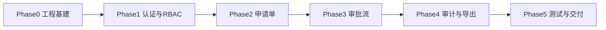
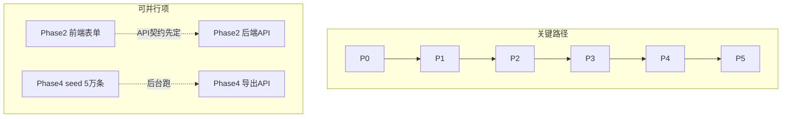

# 企业级资产流转系统 — 分阶段实施计划

## 计划目标

将认证项目拆分为 **6 个阶段（Phase 0 ~ Phase 5）**，每阶段可在 1~2 次 vibecoding 会话内完成，阶段结束即有可运行、可演示的增量交付物。计划对齐 [docs/architecture.md](docs/architecture.md) 与 [全栈工程师认证题目及要求.md](全栈工程师认证题目及要求.md) 的全部评分点。

## 阶段总览



| 阶段 | 名称 | 核心产出 | 预估工时 | 覆盖评分维度 |
|------|------|----------|----------|--------------|
| Phase 0 | 工程基建 | Monorepo + DB + 空壳前后端 | 0.5~1 天 | 工程素养 |
| Phase 1 | 认证与 RBAC 基建 | 登录 + JWT + Guard + 路由守卫 | 0.5~1 天 | 前端权限 5分 + 后端垂直鉴权 7分 |
| Phase 2 | 资产申请单 | 动态表单 + 提交 + 审计写入 | 1~1.5 天 | 前端动态表单 10分 |
| Phase 3 | 审批工作台 | 状态机 + 事务 + 乐观锁 + 三角色视图 | 1.5~2 天 | 后端 23分 + 前端权限/交互 15分 |
| Phase 4 | 审计与导出 | 筛选 + 脱敏 + 流式 Excel | 1~1.5 天 | 后端导出 10分 + 脱敏 5分 |
| Phase 5 | 测试与交付 | 自动化测试 + Docker 部署 + 文档 | 1~1.5 天 | 测试 20分 + 文档 10分 |

**总预估**：5~8 天（按 vibecoding 节奏可弹性调整）

---

## Phase 0：工程基建与数据层

### 目标

搭建可运行的 Monorepo 骨架，数据库模型落地，评审人后续只需 `docker compose up` 即可看到空壳应用。

### 任务清单

**仓库与工具链**
- 初始化 npm/pnpm workspace 根 [`package.json`](package.json)，配置 `apps/web`、`apps/api`、`packages/shared`
- 创建 [`apps/api`](apps/api)：NestJS 10 + TypeScript，`main.ts` 监听 3001，全局前缀 `/api`
- 创建 [`apps/web`](apps/web)：Vite + React 18 + Ant Design 5 + React Router 6
- 创建 [`packages/shared`](packages/shared)：导出 `Role`、`ApplicationStatus`、`AssetCategory` 枚举与 `maskAssetKey` 占位

**数据库**
- 编写 [`apps/api/prisma/schema.prisma`](apps/api/prisma/schema.prisma)，完整实现架构文档 §5.2 五表模型
- 首次 migration：`npx prisma migrate dev`
- 编写 [`apps/api/prisma/seed.ts`](apps/api/prisma/seed.ts) 第一阶段仅灌入：2 部门 + 5 测试账号（密码统一 `123456`）

**Docker 与开发环境**
- [`docker-compose.dev.yml`](docker-compose.dev.yml)：仅 PostgreSQL 15
- [`docker-compose.yml`](docker-compose.yml)：db + api + web（web 用 Nginx 反代，可先占位）
- [`docker/api.Dockerfile`](docker/api.Dockerfile)、[`docker/web.Dockerfile`](docker/web.Dockerfile)、[`docker/nginx.conf`](docker/nginx.conf)
- [`.env.example`](.env.example)：`DATABASE_URL`、`JWT_SECRET`

**后端公共层（空实现）**
- [`apps/api/src/common/filters/http-exception.filter.ts`](apps/api/src/common/filters/http-exception.filter.ts)：统一 `{ code, message, data }`
- [`apps/api/src/common/interceptors/response.interceptor.ts`](apps/api/src/common/interceptors/response.interceptor.ts)
- [`apps/api/src/modules/prisma/prisma.service.ts`](apps/api/src/modules/prisma/prisma.service.ts)

**前端公共层（空实现）**
- [`apps/web/src/api/client.ts`](apps/web/src/api/client.ts)：Axios 实例，baseURL `/api`
- [`apps/web/src/router/index.tsx`](apps/web/src/router/index.tsx)：路由占位 `/login`、`/application`、`/approval`、`/audit`、`/403`
- 各页面 Placeholder 组件 + Ant Design Layout 壳

### 验收标准

- [ ] `docker compose -f docker-compose.dev.yml up -d` 后 DB 可连接
- [ ] `cd apps/api && npm run start:dev` 启动无报错，`GET /api/health` 返回 200
- [ ] `cd apps/web && npm run dev` 可访问，Layout + 路由切换正常
- [ ] `npx prisma db seed` 成功写入部门与用户
- [ ] Prisma Studio 可看到 5 张表结构正确

### Vibecoding 推荐 Prompt

> 「按 docs/architecture.md §4 目录结构，初始化 Monorepo：NestJS api + Vite React web + shared 包；实现 Prisma schema 五表模型；docker-compose.dev 起 PostgreSQL；seed 2 部门 5 账号；前后端空壳可启动。」

---

## Phase 1：认证与 RBAC 基建

### 目标

打通登录链路，建立前后端统一的权限基础设施，后续业务 API 可直接挂载 Guard。

### 任务清单

**后端 `apps/api/src/modules/auth/`**
- `AuthModule`：`POST /api/auth/login`（bcrypt 校验 + JWT 签发）、`GET /api/auth/me`
- JWT Payload：`sub, username, role, departmentId`
- [`apps/api/src/common/guards/jwt-auth.guard.ts`](apps/api/src/common/guards/jwt-auth.guard.ts)
- [`apps/api/src/common/guards/roles.guard.ts`](apps/api/src/common/guards/roles.guard.ts)
- 装饰器：`@Roles()`、`@CurrentUser()`、`@Public()`
- 全局注册 `APP_GUARD`：默认所有路由需 JWT，标记 `@Public()` 除外

**前端**
- [`apps/web/src/stores/authStore.ts`](apps/web/src/stores/authStore.ts)：Zustand 存 token + user
- [`apps/web/src/pages/Login/index.tsx`](apps/web/src/pages/Login/index.tsx)：用户名密码登录，展示测试账号提示
- [`apps/web/src/components/AuthGuard.tsx`](apps/web/src/components/AuthGuard.tsx)：未登录 → `/login`；角色不匹配 → `/403`
- [`apps/web/src/pages/Forbidden/index.tsx`](apps/web/src/pages/Forbidden/index.tsx)
- Axios 拦截器：附加 Bearer Token；401 → 登录；403 → 403 页
- `/audit` 路由挂载 `AuthGuard roles={['ADMIN','AUDITOR']}`

**共享包**
- [`packages/shared/src/enums.ts`](packages/shared/src/enums.ts) 前后端引用统一角色枚举

### 验收标准

- [ ] `employee_a / 123456` 登录成功，返回 JWT，前端跳转 `/application`
- [ ] 员工访问 `/audit`（手动改 URL）→ 跳转 `/403`，DOM 中无审计页内容
- [ ] 未带 Token 调任意受保护 API → 401
- [ ] `admin` 可进入 `/audit` 路由（页面可为占位）
- [ ] 响应格式统一为 `{ code: 0, message, data }`

### Vibecoding 推荐 Prompt

> 「实现 auth 模块：login/me API、JWT、JwtAuthGuard、RolesGuard、@Roles 装饰器；前端 Login 页 + Zustand authStore + AuthGuard；/audit 仅 ADMIN/AUDITOR；Axios 拦截器处理 401/403。」

---

## Phase 2：资产申请单（前后端）

### 目标

完成第一个完整业务闭环：员工填写动态明细表单 → 提交 → 单据 PENDING → 写入审计日志。

### 任务清单

**后端 `apps/api/src/modules/applications/`**
- DTO：`CreateApplicationDto`（reason + items[]），class-validator 校验（reason ≤100、quantity 正整数、category 枚举）
- API：
  - `POST /api/applications` — 创建并直接提交（或创建草稿后 `POST :id/submit`，推荐合并为一步提交简化 vibecoding）
  - `GET /api/applications/mine` — 分页，仅当前用户
  - `GET /api/applications/:id` — 详情（本人或后续审批角色）
- 提交逻辑：status = PENDING，同一事务写 `sys_audit_log`（action=SUBMIT）
- 敏感数据：`SENSITIVE_DATA` 分类自动生成 `assetKey`（如 `SECRET_KEY_2026_X`）
- 接口返回列表/详情时对 `assetKey` 调用 `maskAssetKey`

**状态机基础**
- [`apps/api/src/modules/applications/state-machine.service.ts`](apps/api/src/modules/applications/state-machine.service.ts)：定义转换表（本阶段仅用 SUBMIT）

**前端 `apps/web/src/pages/Application/`**
- `ApplicationForm`：申请人、部门从 `auth/me` 自动带出（只读）
- `AssetItemList`：Ant Design `Form.List`，支持增删行
- 校验：申请原因必填；资产名称必填；数量正整数 >0；提交前 `validateFields`
- 提交成功 → message 提示 + 可选跳转 `/approval`

**种子数据补充**
- seed 增加 5~10 条各状态申请单（本阶段至少 PENDING 若干）

### 验收标准

- [ ] 动态增删明细行，其他行数据不丢失
- [ ] 空原因/负数数量/未填资产名 → 红字拦截，无法提交
- [ ] 提交后 DB：`asset_applications.status=PENDING`，`sys_audit_log` 有 SUBMIT 记录
- [ ] `/approval` 员工视图可看到刚提交的单（列表可先简单 Table）
- [ ] 接口返回的 `assetKey` 已脱敏

### Vibecoding 推荐 Prompt

> 「实现 applications 模块：创建提交 API、mine 列表、详情；Form.List 动态明细前端页；提交时事务写 audit_log；SENSITIVE_DATA 自动生成 assetKey 并脱敏返回。」

---

## Phase 3：审批工作台（核心后端 + 三角色前端）

### 目标

实现审批全链路、状态机事务、乐观锁、水平越权防御，以及审批页三角色视图隔离。本阶段是**最高分值的核心里程碑**。

### 任务清单

**后端 `apps/api/src/modules/approvals/`**
- 完善 `StateMachineService.transition()`：
  - 合法转换校验
  - Prisma `$transaction`：乐观锁 `updateMany(where: { id, version, status })` + `auditLog.create`
  - version 不匹配 → `ConflictException`
- API：
  - `GET /api/approvals/pending` — MANAGER，**其管辖部门**（`departments.manager_id`）的 PENDING 单
  - `POST /api/approvals/:id/approve` — MANAGER + **水平鉴权**（申请人所在部门的 `manager_id === operator.sub`）
  - `POST /api/approvals/:id/reject` — 同上，body.reason 必填
  - `POST /api/applications/:id/withdraw` — EMPLOYEE 本人 + PENDING
  - `GET /api/approvals/all` — ADMIN 全量分页
  - `POST /api/approvals/:id/terminate` — ADMIN 强制终止 PENDING
- 每个 API 挂 `@Roles()`；水平校验在 Service 层

**前端 `apps/web/src/pages/Approval/`**
- 按 `user.role` 条件渲染（**不用 CSS 隐藏**）：
  - `EMPLOYEE` → `MyApplicationsTable`：详情弹窗 + 撤回（仅 PENDING，`loading` 防重复）
  - `MANAGER` → `PendingApprovalsTable`：同意/驳回按钮仅主管渲染；驳回 Modal 强制填原因
  - `ADMIN` → `AllApplicationsTable`：强制终止按钮
- 审批/驳回/撤回/终止按钮：`loading={submitting}`，请求期间 disabled

**联调场景**
- `employee_a` 提交 → `manager_a` 审批通过
- `manager_b` 审批 `employee_a` 的单 → 后端 403

### 验收标准

- [ ] 完整链路：提交 → 主管同意 → APPROVED + audit_log(APPROVE)
- [ ] 驳回必须填原因，audit_log 含 reason、before/after status
- [ ] 员工可撤回 PENDING 单 → WITHDRAWN
- [ ] 管理员可强制终止 → TERMINATED
- [ ] 员工界面 DOM 中无「同意/驳回」按钮（审查元素确认）
- [ ] 水平越权：manager_b 审批研发部单子 → API 403
- [ ] 对已 APPROVED 单再次 approve → 409/400 友好提示
- [ ] 并发双 approve：仅一个成功

### Vibecoding 推荐 Prompt

> 「实现 approvals 模块：状态机 transition 含乐观锁与事务写 audit_log；pending/approve/reject/withdraw/terminate/all API；水平越权校验；前端 Approval 页三角色条件渲染，审批按钮 loading 防重复。」

---

## Phase 4：审计日志、脱敏与流式导出

### 目标

完成第三个核心页面：多条件筛选、脱敏展示、5 万条流式 Excel 导出。

### 任务清单

**种子数据**
- 扩展 [`apps/api/prisma/seed.ts`](apps/api/prisma/seed.ts)：批量插入 **50,000+** 条 `sys_audit_log`（可用 `createMany` 分批，每批 1000）

**后端 `apps/api/src/modules/audit/`**
- `GET /api/audit/logs` — ADMIN/AUDITOR
  - 筛选：`applicantUsername`（推荐）、`applicantId`（兼容）、`category`、**申请单** `status`、**申请单** `createdAt` 时间区间
  - 分页：page + pageSize
  - 返回字段含 `applicationStatus`，assetKey 脱敏
- `GET /api/audit/export` — ADMIN/AUDITOR
  - exceljs `WorkbookWriter` 流式写 Response
  - 游标分批查询（每批 500 条，`orderBy: { id: 'asc' }`）
  - 禁止 `findMany` 一次加载全部
  - Excel 含「单据状态」列

**共享包**
- 完善 [`packages/shared/src/mask.ts`](packages/shared/src/mask.ts)：`SECRET_KEY_2026_X` → `SEC-****-X`

**前端 `apps/web/src/pages/Audit/`**
- 筛选栏：申请人**用户名**、分类、单据状态、申请时间区间
- 搜索输入 **300ms Debounce**（`useDebounceCallback`）
- 列表展示 `applicationStatus` + 脱敏 assetKey
- 「导出 Excel」：blob 下载，**5 分钟超时**，导出期间禁用筛选控件

### 验收标准

- [ ] 组合筛选正确（至少测 2 个条件叠加）
- [ ] 列表与导出中 assetKey 均已脱敏
- [ ] 导出 5 万条时 API 进程内存不明显飙升（可 `docker stats` 观察）
- [ ] 导出文件可用 Excel 打开，列与表头正确
- [ ] 筛选输入防抖：快速输入不连续发 N 次请求

### Vibecoding 推荐 Prompt

> 「实现 audit 模块：多条件分页查询 + exceljs 流式导出（游标每批500）；seed 5万条审计日志；前端 Audit 页带 debounce 筛选与导出按钮；shared maskAssetKey 前后端复用。」

---

## Phase 5：自动化测试、Docker 交付与文档

### 目标

补齐认证交付物，确保评审人 5 分钟内本地跑通，自动化测试覆盖全部必测场景。

### 任务清单

**自动化测试 `apps/api/test/`**
- Jest + Supertest 集成测试（独立 test DB 或 transaction rollback）
- 必测 **13 场景**（见 [`docs/architecture.md`](architecture.md) §12.2）：
  1. 正常审批流
  2. 员工调 approve API → 403
  3. manager_b 越权审批 → 403
  4. 终态重复审批 → 409/400
  5. 驳回后 audit_log 字段断言（含 operator.username）
  6. 列表 assetKey 脱敏断言
  7. 并发 approve 幂等
  8. 员工撤回
  9. 管理员强制终止
  10. 审计 API 脱敏
  11. 员工访问审计 API → 403
  12. 流式导出 Excel + 脱敏列断言
  13. 按申请单 status 筛选（非 afterStatus）
- `npm run test:e2e` 一键执行

**Docker 生产编排**
- 完善 [`docker-compose.yml`](docker-compose.yml)：api 启动前自动 `prisma migrate deploy && prisma db seed`
- web 容器 Nginx 反代 `/api` → api:3001
- 一键脚本 [`scripts/init.sh`](scripts/init.sh)

**文档与交付**
- 更新 [`README.md`](README.md)：5 分钟启动指南、测试账号表、页面路径、API 概览
- 新建 [`PROMPT.md`](PROMPT.md)：记录 vibecoding 使用的核心 Prompt（认证要求）
- 核对 [`docs/architecture.md`](docs/architecture.md) 与实现一致
- 新建 [`docs/implementation-plan.md`](docs/implementation-plan.md)：即本计划文档落盘
- 新建 [`docs/PROMPT.md`](docs/PROMPT.md) 与 [`docs/prompts/`](docs/prompts/)：Vibecoding Prompt 归档
- 部署到云服务器，README 附上访问链接

**收尾检查**
- 全链路手工冒烟（4 角色各走一遍）
- `.gitignore` 确认 `.env` 不入库
- 统一 API 错误码与 README 中的示例一致

### 验收标准

- [ ] `docker compose up -d` 后 ≤5 分钟可登录并操作
- [ ] `npm run test:e2e` 全部通过
- [ ] README + PROMPT.md + architecture.md 齐全
- [ ] 外网部署链接可访问
- [ ] 认证题目「交付必做」清单全部勾选

### Vibecoding 推荐 Prompt

> 「编写 Jest+Supertest 集成测试覆盖 13 个必测场景；完善 docker-compose 一键启动含 migrate+seed；更新 README 五分钟指南和测试账号；创建 PROMPT.md；同步 architecture 文档与实现。」

---

## 阶段依赖与并行策略



- **严格串行**：Phase 0 → 1 → 2 → 3 → 4 → 5（后阶段依赖前阶段基础设施）
- **阶段内并行**：Phase 2/3 可先定 API 契约（OpenAPI 或 README 表格），前后端分开 vibecoding
- **耗时任务**：Phase 4 的 5 万条 seed 可在 Phase 3 结束时提前跑

---

## 每阶段结束的自检模板

每完成一个 Phase，用以下清单快速验证再进入下一阶段：

1. **能跑**：`docker compose` 或 dev 模式启动无报错
2. **能测**：本阶段新增 API 用 curl/Postman 或前端页面走通
3. **能证**：对照 [全栈工程师认证题目及要求.md](全栈工程师认证题目及要求.md) 勾选本阶段覆盖的评分点
4. **能提交**：`git commit` 附阶段说明（如 `feat(phase2): asset application form and submit API`）

---

## 风险与应对

| 风险 | 应对 |
|------|------|
| vibecoding 生成代码风格不一致 | Phase 0 定好目录与命名规范，每阶段 Prompt 引用 architecture.md 章节 |
| 乐观锁/事务逻辑复杂 | Phase 3 优先实现 `StateMachineService` 单测，再挂 Controller |
| 5 万条 seed 慢 | 用 `createMany` 分批；或 raw SQL COPY |
| 流式导出调试难 | 先用 1000 条验证流，再扩到 5 万 |
| 前后端类型漂移 | 枚举与 mask 函数放 `packages/shared`，前后端共同引用 |

---

## 建议落盘位置

计划确认后，将完整内容写入 [`docs/implementation-plan.md`](docs/implementation-plan.md)，与 [`docs/architecture.md`](docs/architecture.md) 并列，作为 vibecoding 会话的索引文档。README 中增加链接：

```markdown
- [认证题目要求](全栈工程师认证题目及要求.md)
- [技术架构方案](docs/architecture.md)
- [分阶段实施计划](docs/implementation-plan.md)
- [Vibecoding Prompt 记录](docs/PROMPT.md)
```
