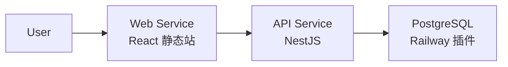

# Railway 部署指南

本文档说明如何将 `asset-flow-sys` 部署到 [Railway](https://railway.app)。

## 架构



| 服务 | 说明 | 公网地址示例 |
|------|------|--------------|
| `postgres` | Railway PostgreSQL 插件 | 仅内网 `DATABASE_URL` |
| `api` | NestJS 后端 | `https://xxx-api.up.railway.app` |
| `web` | React 前端静态站 | `https://xxx-web.up.railway.app` |

### 构建与启动方式

本项目使用 **Config as Code** + **多阶段 Dockerfile**，避免 Nixpacks 在 npm monorepo 下出现 `tsc: not found` 等问题。

| 服务 | 配置文件 | Dockerfile | 构建 | 启动 |
|------|----------|------------|------|------|
| `api` | `railway.api.toml` | `docker/api.Dockerfile` | builder 阶段 `npm ci` + 编译 | preDeploy 迁移/seed → `node dist/main.js` |
| `web` | `railway.web.toml` | `docker/web-railway.Dockerfile` | builder 阶段 `npm ci` + `vite build` | `serve` 静态资源 |

> **说明**：`railway.*.toml` 中的配置会**覆盖** Railway 控制台中的同名设置，一般只需在 Settings 中指定 Config File，无需再手动填写 Build / Start / Pre-deploy 命令。

---

## 前置条件

1. [Railway](https://railway.app) 账号（建议关联 GitHub）
2. 代码已推送到 GitHub 仓库
3. Railway Hobby 计划（约 $5/月，含试用额度）

---

## 第一步：创建 Project 与 PostgreSQL

1. 登录 Railway → **New Project**
2. 选择 **Provision PostgreSQL**（或 Empty Project 后点击 **+ New** → **Database** → **PostgreSQL**）
3. 进入 PostgreSQL 服务 → **Variables** / **Connect**，记下 `DATABASE_URL`（Railway 会自动生成）

---

## 第二步：部署 API 服务

### 2.1 创建服务

1. 在同一 Project 中点击 **+ New** → **GitHub Repo**
2. 选择 `asset-flow-sys` 仓库
3. 将服务重命名为 `api`

### 2.2 服务配置

进入 `api` 服务 → **Settings**：

| 配置项 | 值 |
|--------|-----|
| **Root Directory** | `/`（仓库根目录，默认） |
| **Config File** | `railway.api.toml` |

`railway.api.toml` 已声明以下内容，**无需在 UI 重复填写**：

| 配置项 | 实际值 |
|--------|--------|
| **Builder** | Dockerfile → `docker/api.Dockerfile` |
| **Pre-deploy Command** | `/bin/sh ./scripts/railway-predeploy-api.sh` |
| **Start Command** | `./scripts/railway-start-api.sh` |
| **Healthcheck Path** | `/api/health` |

本地等效命令（调试时可手动执行）：

```bash
npm run railway:predeploy:api   # prisma migrate deploy + seed
npm run railway:start:api       # node apps/api/dist/main.js
```

### 2.3 环境变量

在 `api` 服务 → **Variables** 中添加：

| 变量 | 值 | 说明 |
|------|-----|------|
| `DATABASE_URL` | `${{Postgres.DATABASE_URL}}` | 引用 PostgreSQL 插件变量（服务名以实际为准） |
| `JWT_SECRET` | 随机 32 位字符串 | 生产环境务必修改 |
| `WEB_ORIGIN` | 先留空，Web 部署后再填 | 见第四步 |
| `FORCE_SEED` | `false`（默认） | 设为 `true` 时强制重新灌入种子数据 |

> **引用数据库变量**：在 Variables 中点击 **Add Reference**，选择 PostgreSQL 服务的 `DATABASE_URL`。

### 2.4 生成公网域名

1. `api` 服务 → **Settings** → **Networking** → **Generate Domain**
2. 得到类似：`https://asset-flow-api-production.up.railway.app`
3. 验证：访问 `https://<api域名>/api/health` 应返回 `{"code":0,"message":"success","data":{"status":"ok"}}`

> 首次部署会在 **Pre-deploy** 阶段执行 `prisma migrate deploy` + `seed`（测试账号与 5 万条审计数据），可能需要 **3~10 分钟**。日志中可看到 `Running database migration and seed...`。

---

## 第三步：部署 Web 服务

### 3.1 创建服务

1. 同一 Project → **+ New** → **GitHub Repo** → 再次选择同一仓库
2. 重命名为 `web`

### 3.2 服务配置

| 配置项 | 值 |
|--------|-----|
| **Root Directory** | `/` |
| **Config File** | `railway.web.toml` |

`railway.web.toml` 已声明：

| 配置项 | 实际值 |
|--------|--------|
| **Builder** | Dockerfile → `docker/web-railway.Dockerfile` |
| **Start Command** | `./scripts/railway-start-web.sh`（`serve` 托管 `apps/web/dist`） |

### 3.3 环境变量（关键）

| 变量 | 值 | 说明 |
|------|-----|------|
| `VITE_API_BASE_URL` | `https://<api域名>/api` | **Docker 构建时**注入，必须带 `/api` 后缀 |

示例：

```
VITE_API_BASE_URL=https://asset-flow-api-production.up.railway.app/api
```

> `VITE_` 变量在 **build 阶段**生效（Dockerfile `ARG`）。修改后需 **Redeploy** Web 服务。

### 3.4 生成公网域名

1. `web` 服务 → **Settings** → **Networking** → **Generate Domain**
2. 得到类似：`https://asset-flow-web-production.up.railway.app`

---

## 第四步：配置 CORS

回到 `api` 服务，更新 `WEB_ORIGIN`：

```
WEB_ORIGIN=https://asset-flow-web-production.up.railway.app
```

保存后 Railway 会自动重新部署 API。

若有多个前端域名，用逗号分隔：

```
WEB_ORIGIN=https://xxx.up.railway.app,https://your-domain.com
```

---

## 第五步：验证

1. 打开 Web 公网地址 → 登录页
2. 使用测试账号 `employee_a` / `123456` 登录
3. 提交一条资产申请
4. 换 `manager_a` 登录审批
5. 换 `admin` 登录查看审计日志并导出 Excel

### 测试账号

| 用户名 | 密码 | 角色 |
|--------|------|------|
| employee_a | 123456 | 普通员工 |
| manager_a | 123456 | 研发部主管 |
| manager_b | 123456 | 市场部主管 |
| admin | 123456 | 系统管理员 |
| auditor | 123456 | 合规审计员 |

---

## 可选：本地 Docker 全栈

与 Railway 使用同一套 Dockerfile 在本地启动完整环境：

```bash
docker compose up --build
```

- 前端：http://localhost
- API：http://localhost:3001/api/health

> 本地全栈使用 `docker-compose.yml`（Web 为 `docker/web.Dockerfile` + Nginx），与 Railway 的 `docker/web-railway.Dockerfile`（`serve`）略有不同，但 API 构建逻辑一致。

---

## 可选：Nixpacks 脚本构建（不推荐）

仓库仍保留 `scripts/railway-build-*.sh` 与 `npm run railway:build:*`，但 **Nixpacks 在 monorepo 上易失败**（`tsc: not found`、`Exit handler never called`）。仅在排查问题时参考，生产部署请使用 Dockerfile。

---

## 常见问题

### 1. 前端登录报 Network Error

- 检查 `VITE_API_BASE_URL` 是否正确（含 `https://` 和 `/api`）
- 修改后必须 **重新部署 Web**（Rebuild）
- 检查 API 的 `WEB_ORIGIN` 是否包含 Web 域名

### 2. API 启动失败 / 数据库连接错误

- 确认 `DATABASE_URL` 引用了 PostgreSQL 插件
- 确认 API 与 PostgreSQL 在**同一 Project**
- 查看 API 服务 **Deployments** → **View Logs**

### 3. 每次部署都重新 seed？

不会。`seed.ts` 在已有用户数据时自动跳过。仅当设置 `FORCE_SEED=true` 时强制重新灌数据。

### 4. 首次部署很慢

seed 会写入 50,000+ 条审计日志，属正常现象。Pre-deploy 日志中出现 `Seed completed` 或 `Seed skipped` 表示完成。

### 5. 构建报 `tsc: not found` 或仍走 Nixpacks 脚本

- 确认 Settings → **Config File** 已设为 `railway.api.toml` / `railway.web.toml`
- 确认部署日志为 Docker 构建（`FROM node:20-alpine AS builder`），而非 `railway-build-api.sh`
- 若曾用 Nixpacks 失败过：Settings → **Clear Build Cache** 后重新部署

### 6. 自定义域名

各服务 **Settings** → **Networking** → **Custom Domain** 可绑定自己的域名。绑定后记得同步更新 `WEB_ORIGIN` 和 `VITE_API_BASE_URL`。

---

## 认证交付清单

部署完成后，在 README 或提交说明中附上：

```markdown
## 在线演示

- 前端：https://web-production-da953.up.railway.app/login
- API Health：https://web-production-da953.up.railway.app/api/health
- 测试账号：employee_a / 123456
```

---

## 费用参考

- Hobby 计划约 $5/月
- PostgreSQL + 2 个 Service 小型演示约 **$5~15/月**
- 不用时可在 Railway 中 Pause 服务节省费用
